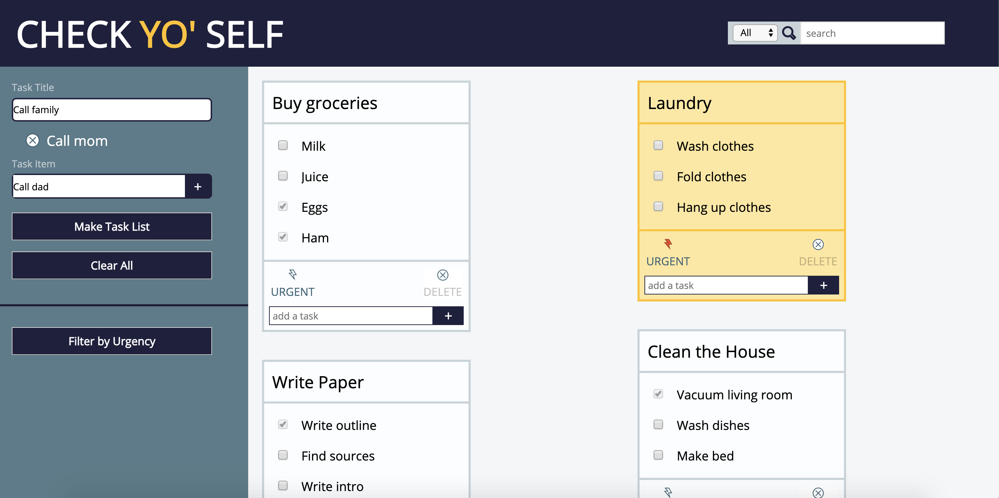

# Check Yo' SELF

## Overview of project and goals

For this project, I built a website that allows users to create task lists, check them
off, mark tasks as urgent, and delete task lists once completed. The information for
these lists is stored in localStorage so that users can return to the site and still
have access to their lists and their statuses.

Learning goals for this project:
- Grow more comfortable with utilizing JSON and localStorage
- Maintain access to object methods after they are parsed from storage
- Increase comfort with array prototypes
- Use two classes and nested objects to update the data model
- Use ems exclusively for sizing

## Overview of technologies used, challenges, and wins, any other reflections

Technologies used:
- HTML
- CSS
- JavaScript

Challenges:
- Accessing nested objects within an object and ensuring that their methods persist was
challenging. I had to re-instantiate all objects on page load.
- Targeting an entire box on click instead of any individual component was tricky.
- It took me a while to get the urgent status to persist because I was accidentally resetting the urgent status to false on page load.

Wins:
- I was able to work through this project much more quickly than my previous project since
I had some exposure to and experience with the high level topics covered.
- The extensions I completed for Build a Bear proved helpful in preparing myself for this project.
- I was able to use the class methods throughout the main.js file to localize changes to given objects.

Reflections:
- For my partner projects, we completed everything side by side, so there were no aspects of the functionality
that I didn't fully understand. My study habits early on in the mod made this project relatively lacking in stress.
- I am now able to work through large chunks of functionality without needing as many internet references or questions answer from mentors.

## Screenshots of comp and your app

